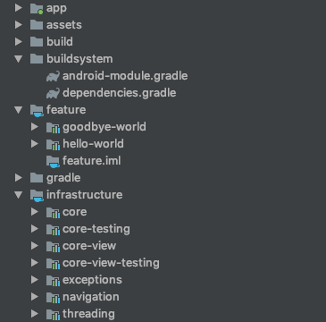
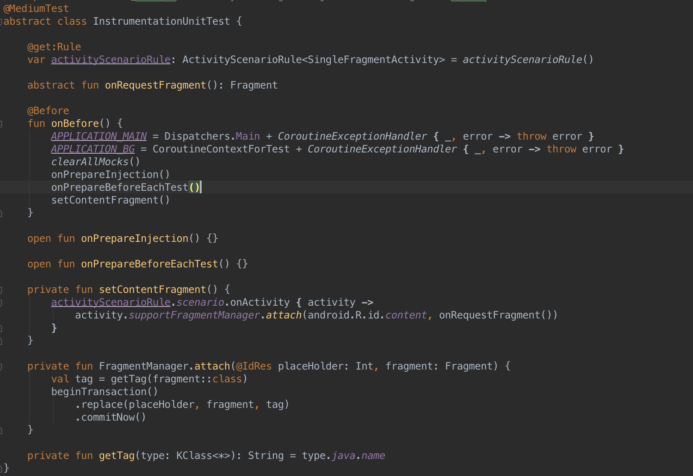
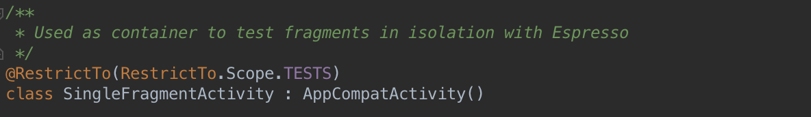
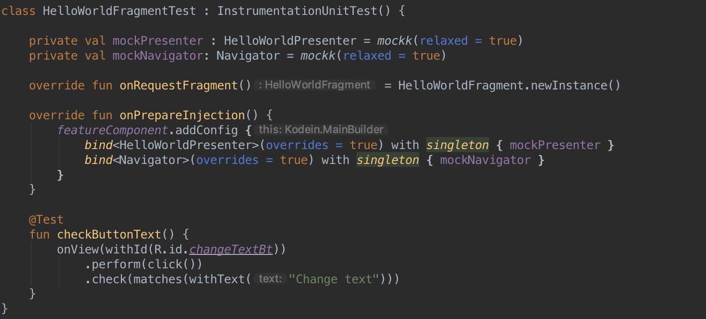

# Android UI Testing in a modular app 
The purpose of this post is to explain what was the process followed in Metropolis:lab to enable UI Testing in our Android applications, based on our current projects structure and architecture.

## What is our challenge?
In Metropolis-lab, we talked about what would be a good UI testing approach. Our current structure leaves to each feature module the responsibility to contain its own unit test, so UI test should be the same, it should be contained in each one of the feature modules. That way, if one day one feature module is no longer needed, we can get rid of it deleting a single folder, we won't have any other references to the code contained there.
We are following [clean code architecture](https://blog.cleancoder.com/uncle-bob/2012/08/13/the-clean-architecture.html) with MVP. Recently, we migrated to new [AndroidX](https://developer.android.com/jetpack/androidx) libraries provided by Google, so views, Fragments and Activities are based on these new libraries. We are managing dependency injection with [Kodein](https://kodein.org/di/) and our code is 100% in Kotlin.
We are constructing our views with a dummy Activity whose just contain a main Fragment. Depending on the complexity of the feature, this Fragment can act as a composer with smaller Fragment inside it or as a main view.

 

So, based on this stack of technologies, our challenge is:
- Be able of test each one of the Fragments separately, i.e. GoodbyeActionFragment and GoodbyeNavigationFragment.
- Have all UI tests in the same module of the views tested.
- Mock dependencies before the dependency tree is build and the app launched.

## What do we have?
Currently, we are developing 2 different apps: [getkomuti.io](https://getkomuti.io) and [bybus.io](https://bybus.io), both applications are following the same structure and architecture and share some core components. Its main characteristic is the modularisation, trying to split and decouple the code the more we can.
If you want to explore deeper how we face this modularisation you can check this repository: [https://github.com/txusballesteros/modularization](https://github.com/txusballesteros/modularization). But here it comes a brief explanation to understand better our situation. Our projects contains 4 main folders:
- **App**: with the application class, main manifest and the entry point of the application.
- **Buildsystem**: dependencies and common gradle configurations.
- **Feature**: with all the feature modules our app will contain.
- **Infrastructure**: with core and common modules.

 

In our projects activities are no more than simple containers, we delegate our lifecycles to Fragments. Depending on the complexity of a feature we can have a single Fragment or a composer Fragment that orchestrates smaller Fragments inside it.

## What is our proposal?
We based our solution in a [post of Aitor Viana](https://medium.com/@aitorvs/isolate-your-fragments-just-for-testing-ea7d4fddcba2) which talks about Fragment testing, but adapted to our needs:
- Coroutines initialization.
- Mockk for mocking because its support of coroutines.
- New AndroidX libraries for testing,
- Use of our base classes do delete boilerplate.

That way we have a base UI Unit Test class with the coroutines context initialisation, cleaned of mocks, creation and attachment of target Fragment and 2 open functions: one to override dependency injection and the other to initialise mocks.

 
This relies on a Activity which only purpose is to attach the target Fragment to launch in the UI Test:

 
So we can see how will look an example implementing this tools:

 
With that, we are able to add UI Unit Test separately in each one of our feature modules, making them independents of the app module.

## TL;DR
We prepare some base classes to help us adding UI Unit Tests in each one of our modularised Android application, with that we are able to mock dependencies, replace dependency injections and run UI tests of Fragments instead of checking the whole Activity
To see more of how we implemented that, checkout this repository: https://github.com/antonio-manuel/UIModularTesting
